  

My coursework for **CSD 440: Server-Side Scripting**. Each folder is one module's assignment. The course starts with a single PHP page and builds up to forms that validate input, save it to MySQL and return it as JSON.

In the banner, each pellet the elephant eats is one module, and each bug is a real bug that was fixed along the way.

## Insert coin

1. Install [XAMPP](https://www.apachefriends.org/) and start **Apache**. Start **MySQL** too if you want to play stages 8 and 9.
2. Clone this repo into `C:\xampp\htdocs\`.
3. Open a stage in your browser, e.g. `http://localhost/csd-440/Modules/Module_10/miguel_json_form.html`.

Stages 8 and 9 log in to the `baseball_01` database as `student1` / `pass`, the shared account given by the course.

## Stage select

### World 1: PHP basics

| Stage | Folder | Start here | What it does |
|:-:|---|---|---|
| 1.2 | [`Module_1.2`](Modules/Module_1.2) | PDF | Sets up this GitHub repo |
| 1.3 | [`Module_1.3`](Modules/Module_1.3) | `FernandezFirstProgram.php` | First PHP page: prints today's date and loops through a list |
| 2.2 | [`Module_2.2`](Modules/Module_2.2) | `Migueltable2.php` | Builds a table of random numbers with nested loops |
| 3 | [`Module_3`](Modules/Module_3) | `migueltable3.php` | Fills a table with sums from a function in a separate file |
| 4.2 | [`Module_4.2`](Modules/Module_4.2) | `Miguelpalindrome.php` | Tests six strings and says which are palindromes |

### World 2: Arrays, classes and forms

| Stage | Folder | Start here | What it does |
|:-:|---|---|---|
| 5 & 6 | [`Module_5_and_6`](Modules/Module_5_and_6) | `Miguelcustomers.php` | Searches and sorts a list of customers with array functions |
| | | `Miguelmyinteger.php` | A class that stores a number and checks if it's even, odd or prime |
| 7.2 | [`Module_7.2`](Modules/Module_7.2) | `MiguelForm.html` | An employee form; PHP checks each field and lists any errors |

### World 3: Databases and data

| Stage | Folder | Start here | What it does |
|:-:|---|---|---|
| 8 | [`Module_8`](Modules/Module_8) | `MiguelCreateTable.php` | Creates, fills, queries and drops a table of video games |
| 9 | [`Module_9`](Modules/Module_9) | `MiguelIndex.php` | Searches a pilot roster and adds new pilots through a form |
| 10 | [`Module_10`](Modules/Module_10) | `miguel_json_form.html` | Checks a customer form and returns the data as JSON |

Each folder also has screenshots of its test runs.

## High score

Every page was run through **52 automated checks**, and all 52 pass. The checks send valid and invalid form input, try to inject HTML, and run the full create → fill → query → drop cycle against a real MySQL database.

## Credits

- **Author:** Miguel Fernandez, CSD 440
- **Stack:** PHP 8.2 and MariaDB on XAMPP, using MySQLi with prepared statements
- **AI use:** [Claude Code](https://claude.com/claude-code) helped check for bugs and write comments; each file's header says so. The arcade banner is generated by [`assets/make_banner.php`](assets/make_banner.php).
